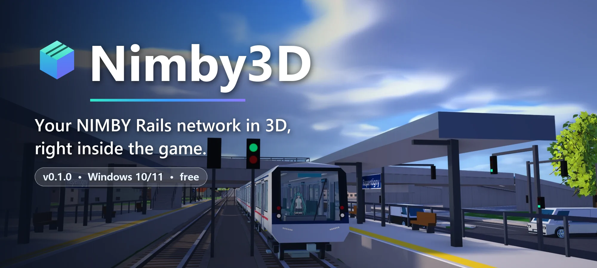
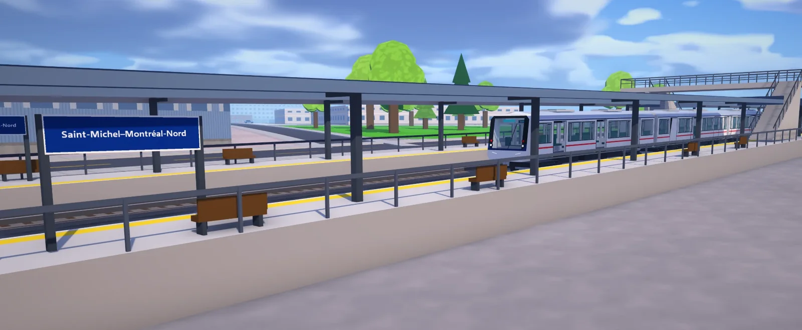
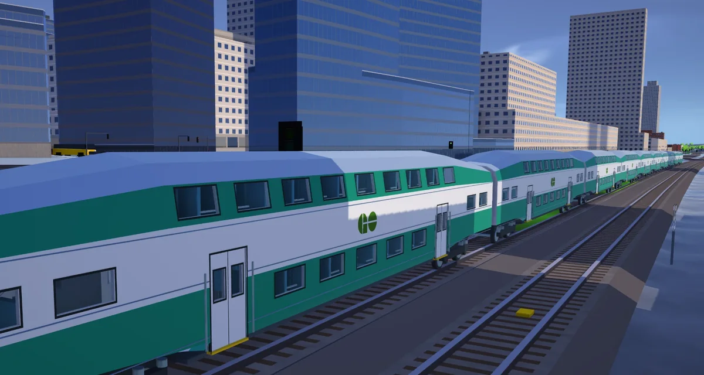
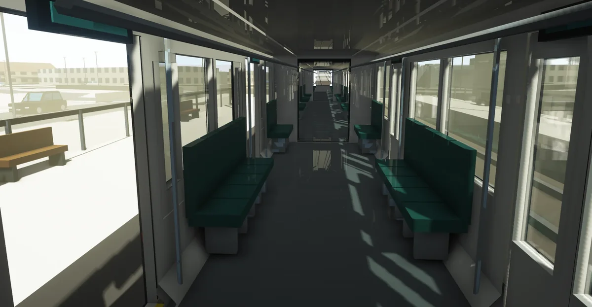
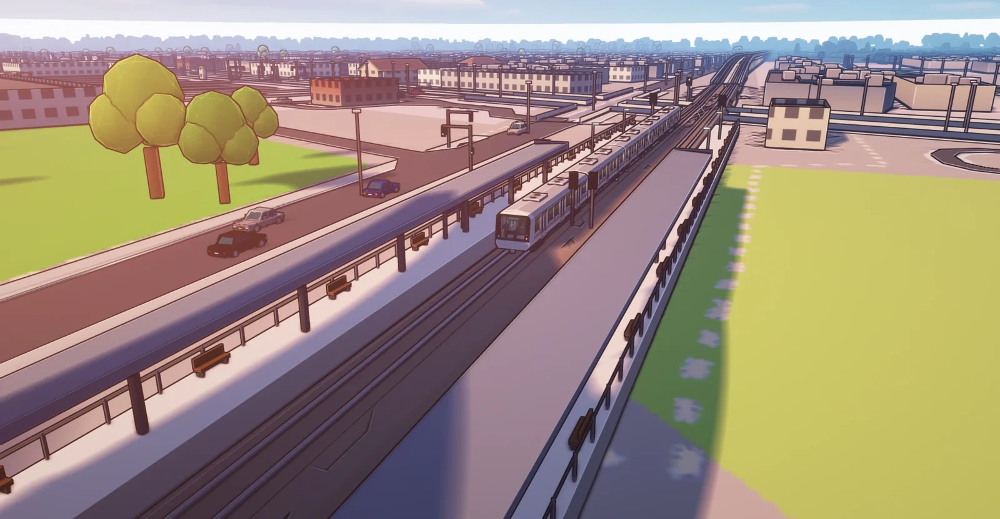
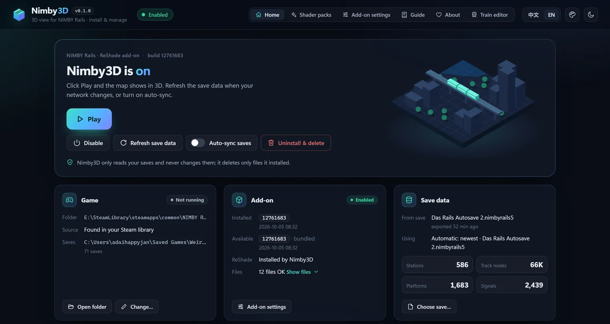
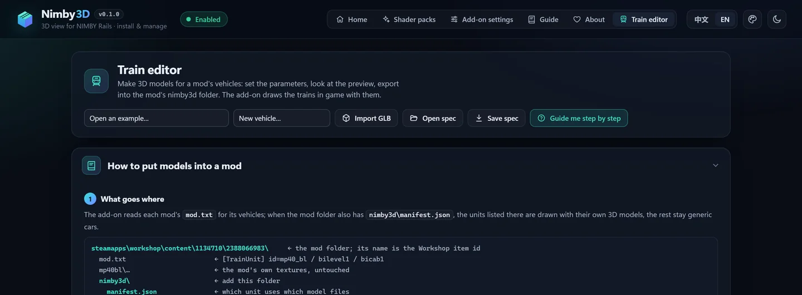
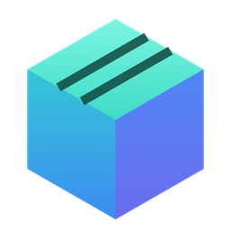

 

**English** &nbsp;·&nbsp; [简体中文](README.zh-CN.md)

 

<h3>Tilt the map, and your railway stands up.</h3>

Nimby3D turns the NIMBY Rails map into a 3D world <b>in the game's own window</b>: 
terrain, track on the ground, on viaducts and in tunnels, stations and trains, built from your save and the game's own map. 
Keep playing as usual; drag with the middle mouse button whenever you want to look around.

[Features](#features) · [Quick start](#quick-start) · [Keys](#keys-in-the-game) · [Train models](#3d-models-for-your-train-mods) · [FAQ](#faq)

 

<table>
<tr>
<td width="50%" valign="top">

<b>Trains wear their mods' 3D models</b> 
Car by car, with livery, doors and windows, following the game's own trains.
</td>
<td width="50%" valign="top">

<b>Step inside</b> 
Walk the platforms in first or third person, then board the car beside you and ride along.
</td>
</tr>
</table>

An elevated line, its stations and the street below, with the traffic of the game's own map.

> [!NOTE]
> The pictures are for reference only. Shader packs, train models (they come with train mods) and player figures are not part of Nimby3D: install them yourself.

## Features

<table>
<tr>
<td width="33%" valign="top">

### 🏔️ The real ground
Terrain from the game's own elevation data, fields, forests and water by land cover, with lakes and rivers that shine and ripple.

</td>
<td width="33%" valign="top">

### 🛤️ Your railway, built
Ballast, sleepers and rails; viaducts on piers, tunnels and covered ramps; platforms, canopies, signals and footbridges at every station.

</td>
<td width="33%" valign="top">

### 🚆 Living trains
The game's trains, drawn with their mods' 3D models, with lit windows at night. Trains without a model become a car of the right length.

</td>
</tr>
<tr>
<td valign="top">

### 🏙️ A whole city
Buildings, roads, bridges, street lamps, traffic and boats, all from the map that ships with the game. Nothing to download.

</td>
<td valign="top">

### 🌤️ Sky and time
Day and night follow the game's clock, with a real sun position, volumetric clouds, weather and shadows.

</td>
<td valign="top">

### 🚶 Walk and ride
First and third person, with a VRM figure of your own if you like. Board a train with <kbd>R</kbd> and watch the line go by.

</td>
</tr>
<tr>
<td valign="top">

### 🎛️ One-click manager
Install & Play, refresh save data, auto-sync, disable, uninstall. It shows exactly which files it put in the game folder.

</td>
<td valign="top">

### 🎨 Your look
Every setting in an in-game panel (<kbd>F10</kbd>) with presets from Ultra to Minimal, plus Minecraft Iris / OptiFine shader packs as an option.

</td>
<td valign="top">

### 🧰 Train editor
Make 3D models for your own train mods, step by step, or import a model made in Blender.

</td>
</tr>
</table>

## Quick start

**1.** [Download **Nimby3D-0.1.0-win64.zip**](https://github.com/adaihappyjan/NIMBY-3D/releases/latest/download/Nimby3D-0.1.0-win64.zip).

**2.** Right-click the ZIP → **Extract All…**

**3.** Open the folder and double-click **Nimby3D.exe**.
If Windows says "Windows protected your PC", click **More info → Run anyway**. The program is not code-signed.

**4.** Click **Install & Play**. NIMBY Rails starts with Nimby3D installed.

**5.** In the game, hold the **middle mouse button** and drag down to tilt the map into 3D.

After you change your network, click **Refresh save data**, or turn on **Auto-sync saves**. Nothing else to install: Nimby3D brings its own Python.

**You need:** Windows 10 or 11 (64-bit), [NIMBY Rails](https://store.steampowered.com/app/1134710/NIMBY_Rails/) from Steam and a DirectX 11 graphics card. Shader packs need an NVIDIA card for now.

## Keys in the game

| Key | What it does | | Key | What it does |
|---|---|---|---|---|
| <kbd>F8</kbd> | 3D view on / off | | <kbd>F10</kbd> | Nimby3D settings panel |
| Middle-drag | Turn and tilt (drag back up for 2D) | | <kbd>Ctrl</kbd>+<kbd>F10</kbd> | First person: <kbd>W</kbd><kbd>A</kbd><kbd>S</kbd><kbd>D</kbd> walk, <kbd>Shift</kbd> run, <kbd>Space</kbd> jump |
| Right-drag, <kbd>W</kbd><kbd>A</kbd><kbd>S</kbd><kbd>D</kbd> | Pan | | <kbd>C</kbd> or <kbd>Shift</kbd>+<kbd>F10</kbd> | Third person |
| Wheel | Zoom about the cursor | | <kbd>R</kbd> | Get on / off the car beside you |
| <kbd>Ctrl</kbd>+<kbd>F8</kbd> | Terrain height 1×, 2×, 3×, 5× | | <kbd>Shift</kbd>+<kbd>F8</kbd> | Show what is underground |

The **Guide** page in Nimby3D explains everything else, including weather, sound and station markers.

## 3D models for your train mods

Nimby3D draws a train with the 3D models its mod carries in a `nimby3d` folder; trains without one become a car of the right length. The **Train editor** makes these models for Workshop mods and for your own mods in `%USERPROFILE%\Saved Games\Weird and Wry\NIMBY Rails\mods`:

- **Guide me step by step:** nine steps worked through with the GO Transit example, from picking the mod's unit to testing it in the game.
- **Colours from the mod itself:** the unit's own top-view pictures sit beside the 3D preview; click to pick a colour, and line up doors and windows with them.
- **Templates:** EMU car, coach, cab car, hood locomotive and box-cab electric, stretched to the unit's length and width, with three levels of detail.
- **Import GLB:** bring in a model made in Blender. The guide's *Model it in Blender* section gives the axes, the export settings and a naming checklist.

## More

<table>
<tr><td width="24%" valign="top">🧍 <b>Your figure</b></td><td valign="top">Choose a VRM model of your own under <i>Player figure</i>. It is copied only into your game folder and never shared.</td></tr>
<tr><td width="24%" valign="top">✨ <b>Shader packs</b></td><td valign="top">Experimental, NVIDIA only, off by default. The <i>Shader packs</i> page manages the Iris / OptiFine packs in <code>%APPDATA%\.minecraft\shaderpacks</code>: add one, choose it, set its options, or move it to the Recycle Bin.</td></tr>
<tr><td width="24%" valign="top">⚙️ <b>Add-on settings</b></td><td valign="top">Every setting of the in-game panel, kept in <code>nimby3d.ini</code> in the game folder, with presets from Ultra to Minimal for slower PCs.</td></tr>
<tr><td width="24%" valign="top">🎨 <b>Appearance</b></td><td valign="top">The palette button at the top right picks a look for Nimby3D (Classic, Lazy Afternoon, Sleepy, Night Shift). Each can take a picture of your own.</td></tr>
<tr><td width="24%" valign="top">🌐 <b>Language</b></td><td valign="top">English and 简体中文, following Windows until you pick one.</td></tr>
</table>

## FAQ

<b>Does Nimby3D change my saves or the game?</b>

 
No. It only reads your saves, and it never changes the game's own files. It adds a few files to the game folder (ReShade's <code>dxgi.dll</code>, the add-on and its data) and lists them all. <b>Uninstall &amp; delete</b> removes exactly those files and nothing else.

<b>Windows or my antivirus warns about it</b>

 
Nimby3D is not code-signed, so SmartScreen asks first: <b>More info → Run anyway</b>. The add-on is loaded by <a href="https://reshade.me">ReShade</a> through its official add-on build of <code>dxgi.dll</code>, which some antivirus programs flag only because it is loaded by the game.

<b>My trains are plain boxes</b>

 
A train looks like its real self when its mod carries a 3D model in a <code>nimby3d</code> folder. Without one it is drawn as a car of the right length. You can make the model with the <b>Train editor</b>.

<b>It runs slowly</b>

 
Press <kbd>F10</kbd> in the game and pick a lower preset (High, Medium, Low or Minimal), or lower the building range, shadows and clouds one by one. The panel shows what costs the most time on your graphics card.

<b>Something does not show up</b>

 
Click <b>Refresh save data</b> after building new track, or turn on <b>Auto-sync saves</b>. The small square at the bottom left of the game shows the state: red = finding the place, green = found, cyan = 3D, orange = 3D but the place is unknown. The <b>Add-on log</b> and <b>ReShade log</b> tabs in Nimby3D show what happened.

<b>How do I remove it?</b>

 
Close the game, open Nimby3D and click <b>Uninstall &amp; delete</b>. It shows the list first. Then delete the Nimby3D folder. Nimby3D's own settings are in <code>%LOCALAPPDATA%\Nimby3D</code>.

## Credits

- The portrait on the About page is art by **PoLa** ([pixiv](https://www.pixiv.net/users/26489227)), cropped from “水着ルビー” ([artwork](https://www.pixiv.net/artworks/110183004)) and used as the author's avatar. The character, 星野ルビー (Hoshino Ruby) from 【推しの子】, belongs to its rights holders. The portrait is not covered by Nimby3D's licence.
- Nimby3D includes ReShade, Python and other components under their own licences: see [THIRD_PARTY_NOTICES.md](THIRD_PARTY_NOTICES.md).

## Licence

Nimby3D is released under the [MIT licence](LICENSE). It is a fan project and is not affiliated with Weird and Wry (NIMBY Rails) or with ReShade.

 

 
Made for the NIMBY Rails community by <a href="https://github.com/adaihappyjan">adaihappyjan</a> · also by the author: <a href="https://github.com/adaihappyjan/NIMBY-Timetable-Toolkit">NIMBY Timetable Toolkit</a>

