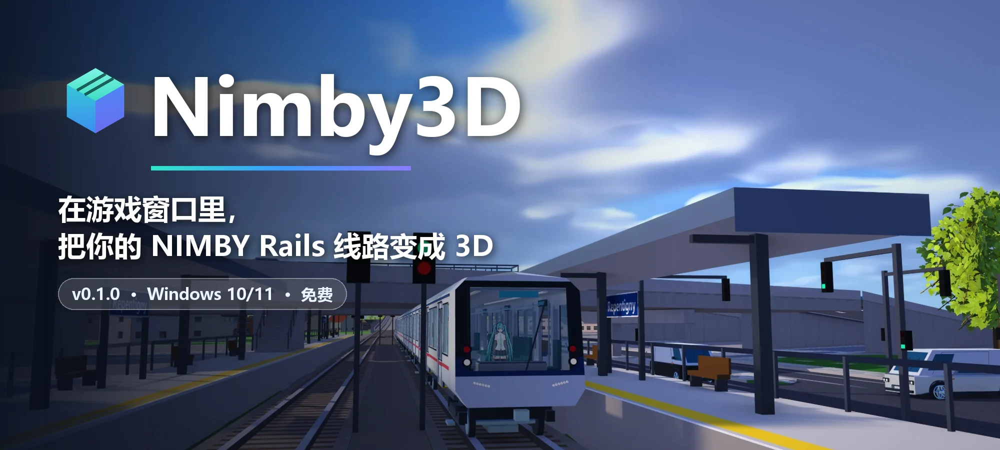

 

[English](README.md) &nbsp;·&nbsp; **简体中文**

 

<h3>把地图一斜，你的铁路就立起来了。</h3>

Nimby3D 在<b>游戏自己的窗口里</b>把 NIMBY Rails 的地图变成 3D 世界： 
地形，地面、高架和隧道里的轨道，车站和列车，全部来自你的存档和游戏自带的地图。 
照常玩你的游戏；想看看的时候，按住鼠标中键拖一下就行。

[功能](#功能) · [快速开始](#快速开始) · [按键](#游戏内按键) · [列车模型](#给你的列车模组做-3d-模型) · [常见问题](#常见问题)

 

<table>
<tr>
<td width="50%" valign="top">

<b>列车用上模组自带的 3D 模型</b> 
一节一节对应游戏里的列车：涂装、车门、车窗都在。
</td>
<td width="50%" valign="top">

<b>走进车厢</b> 
用第一或第三人称在站台上走，登上旁边的车，跟着列车一起跑。
</td>
</tr>
</table>

高架线路、车站和桥下的街道，车流来自游戏自带的地图。

> [!NOTE]
> 图片仅供参考。光影包、列车模型（来自列车模组）和人物模型等不包含在 Nimby3D 里，需要自行安装。

## 功能

<table>
<tr>
<td width="33%" valign="top">

### 🏔️ 真实的地面
地形来自游戏自带的高程数据；田野、森林、水面按地表类型绘制，湖泊和河流有波光和涟漪。

</td>
<td width="33%" valign="top">

### 🛤️ 把你的铁路建出来
道砟、轨枕和钢轨；带桥墩的高架、隧道和带顶棚的坡道；每座车站都有站台、雨棚、信号机和天桥。

</td>
<td width="33%" valign="top">

### 🚆 会动的列车
游戏里的列车用模组自带的 3D 模型绘制，夜里车窗会亮。没有模型的列车显示为长度正确的车厢。

</td>
</tr>
<tr>
<td valign="top">

### 🏙️ 整座城市
建筑、道路、桥梁、路灯、车流和船只，全部来自游戏自带的地图，不需要另外下载。

</td>
<td valign="top">

### 🌤️ 天空和时间
昼夜跟随游戏时钟，太阳位置是真实的；有体积云、天气和阴影。

</td>
<td valign="top">

### 🚶 走路和乘车
第一人称和第三人称，可以换成你自己的 VRM 人物。按 <kbd>R</kbd> 上车，看着沿线风景过去。

</td>
</tr>
<tr>
<td valign="top">

### 🎛️ 一键管理
安装并开始游戏、更新存档数据、自动同步、停用、卸载。它会列出放进游戏文件夹的每一个文件。

</td>
<td valign="top">

### 🎨 你想要的样子
游戏内面板（<kbd>F10</kbd>）里有全部设置和从“最高”到“最低”的预设，还可以选用 Minecraft Iris / OptiFine 光影包。

</td>
<td valign="top">

### 🧰 列车编辑器
一步步为你自己的列车模组制作 3D 模型，也可以导入在 Blender 里做好的模型。

</td>
</tr>
</table>

## 快速开始

**1.** [下载 **Nimby3D-0.1.0-win64.zip**](https://github.com/adaihappyjan/NIMBY-3D/releases/latest/download/Nimby3D-0.1.0-win64.zip)。

**2.** 右键点击 ZIP →“**全部解压缩…**”。

**3.** 打开解压出来的文件夹，双击 **Nimby3D.exe**。
如果 Windows 提示“Windows 已保护你的电脑”，点 **更多信息 → 仍要运行**。程序没有代码签名。

**4.** 点 **安装并开始游戏**。NIMBY Rails 会带着 Nimby3D 启动。

**5.** 在游戏里按住**鼠标中键**向下拖，地图就会倾斜成 3D。

修改线路后点 **更新存档数据**，或者打开 **自动同步存档**。不需要另外安装任何东西：Nimby3D 自带 Python。

**需要：** Windows 10 或 11（64 位）、Steam 上的 [NIMBY Rails](https://store.steampowered.com/app/1134710/NIMBY_Rails/)、支持 DirectX 11 的显卡。光影包目前需要 NVIDIA 显卡。

## 游戏内按键

| 按键 | 作用 | | 按键 | 作用 |
|---|---|---|---|---|
| <kbd>F8</kbd> | 打开 / 关闭 3D 视图 | | <kbd>F10</kbd> | Nimby3D 设置面板 |
| 中键拖动 | 转动和倾斜（向上拖回去即回到 2D） | | <kbd>Ctrl</kbd>+<kbd>F10</kbd> | 第一人称：<kbd>W</kbd><kbd>A</kbd><kbd>S</kbd><kbd>D</kbd> 行走，<kbd>Shift</kbd> 奔跑，<kbd>空格</kbd> 跳跃 |
| 右键拖动、<kbd>W</kbd><kbd>A</kbd><kbd>S</kbd><kbd>D</kbd> | 平移 | | <kbd>C</kbd> 或 <kbd>Shift</kbd>+<kbd>F10</kbd> | 第三人称 |
| 滚轮 | 以鼠标位置为中心缩放 | | <kbd>R</kbd> | 上 / 下旁边的那节车 |
| <kbd>Ctrl</kbd>+<kbd>F8</kbd> | 地形高度 1×、2×、3×、5× | | <kbd>Shift</kbd>+<kbd>F8</kbd> | 显示地下部分 |

其他内容，包括天气、声音和车站标记，都在 Nimby3D 的 **使用教程** 页面里。

## 给你的列车模组做 3D 模型

列车会用它所在模组里 `nimby3d` 文件夹中的 3D 模型来画；没有模型的列车显示为长度正确的车厢。**列车编辑器** 可以为创意工坊模组，以及你放在 `%USERPROFILE%\Saved Games\Weird and Wry\NIMBY Rails\mods` 里的本地模组制作这些模型：

- **一步步教我做：** 九个步骤，用 GO Transit 示例从头做一遍，从选择模组里的车辆一直到在游戏里测试。
- **直接从模组取色：** 车辆自带的俯视图放在 3D 预览旁边；点一下就能取色，车门和车窗也可以对着它对齐。
- **模板：** 动车组车厢、客车、控制车、内燃机车和箱式电力机车，自动拉伸到车辆的长宽，带三级细节（LOD）。
- **导入 GLB：** 导入你在 Blender 里做的模型。教程里的“在 Blender 里建模”一节说明了坐标轴、导出设置和命名检查清单。

## 更多

<table>
<tr><td width="24%" valign="top">🧍 <b>你的人物</b></td><td valign="top">在“人物模型”里选择你自己的 VRM 模型。它只会复制到你自己的游戏文件夹，不会分享出去。</td></tr>
<tr><td width="24%" valign="top">✨ <b>光影包</b></td><td valign="top">实验功能，仅 NVIDIA，默认关闭。“光影包”页管理 <code>%APPDATA%\.minecraft\shaderpacks</code> 里的 Iris / OptiFine 光影包：添加、选用、调整选项，或移到回收站。</td></tr>
<tr><td width="24%" valign="top">⚙️ <b>插件设置</b></td><td valign="top">游戏内面板的全部设置，保存在游戏文件夹的 <code>nimby3d.ini</code> 里；配置较低的电脑可以用“最高”到“最低”的预设。</td></tr>
<tr><td width="24%" valign="top">🎨 <b>外观</b></td><td valign="top">右上角的调色板按钮可以给 Nimby3D 换外观（经典、午后、困困、夜班），每套都能换成你自己的图。</td></tr>
<tr><td width="24%" valign="top">🌐 <b>语言</b></td><td valign="top">English 和简体中文，默认跟随 Windows，也可以自己选。</td></tr>
</table>

## 常见问题

<b>Nimby3D 会修改我的存档或游戏吗？</b>

 
不会。它只读取你的存档，也不会改动游戏自己的文件。它会往游戏文件夹里加几个文件（ReShade 的 <code>dxgi.dll</code>、插件和它的数据），并全部列出来。<b>卸载并删除</b> 只删除这些文件，别的一概不动。

<b>Windows 或杀毒软件报警</b>

 
Nimby3D 没有代码签名，所以 SmartScreen 会先问一下：点 <b>更多信息 → 仍要运行</b>。插件由 <a href="https://reshade.me">ReShade</a> 官方的插件版 <code>dxgi.dll</code> 加载；有些杀毒软件只是因为它被游戏加载而报警。

<b>我的列车只是一个个方块</b>

 
列车所在的模组带有 <code>nimby3d</code> 文件夹里的 3D 模型时，列车才会显示成真实的样子；没有模型时显示为长度正确的车厢。你可以用 <b>列车编辑器</b> 来做这个模型。

<b>运行很卡</b>

 
在游戏里按 <kbd>F10</kbd>，选一个更低的预设（高、中、低或最低），或者逐项调低建筑范围、阴影和云。面板会显示哪一部分在你的显卡上最耗时。

<b>有东西没有显示出来</b>

 
建了新轨道后点 <b>更新存档数据</b>，或者打开 <b>自动同步存档</b>。游戏左下角的小方块显示状态：红色 = 正在寻找位置，绿色 = 已找到，青色 = 3D，橙色 = 3D 但位置未知。Nimby3D 底部的 <b>插件日志</b> 和 <b>ReShade 日志</b> 标签页会显示发生了什么。

<b>怎么删除？</b>

 
关闭游戏，打开 Nimby3D，点 <b>卸载并删除</b>。它会先列出清单。然后删除 Nimby3D 文件夹即可。Nimby3D 自己的设置在 <code>%LOCALAPPDATA%\Nimby3D</code>。

## 致谢

- “关于作者”页面的头像由 **PoLa** 绘制（[pixiv](https://www.pixiv.net/users/26489227)），截取自作品「水着ルビー」（[作品页](https://www.pixiv.net/artworks/110183004)），用作作者头像。角色星野ルビー（【推しの子】）的权利归其权利人所有。头像不在 Nimby3D 的许可范围内。
- Nimby3D 包含的 ReShade、Python 等组件使用各自的许可，见 [THIRD_PARTY_NOTICES.md](THIRD_PARTY_NOTICES.md)。

## 许可

Nimby3D 以 [MIT 许可](LICENSE) 发布。这是一个玩家自制项目，与 Weird and Wry（NIMBY Rails）及 ReShade 没有关联。

 

 
由 <a href="https://github.com/adaihappyjan">adaihappyjan</a> 为 NIMBY Rails 玩家制作 · 作者的另一个项目：<a href="https://github.com/adaihappyjan/NIMBY-Timetable-Toolkit">NIMBY 时刻表工具箱</a>

